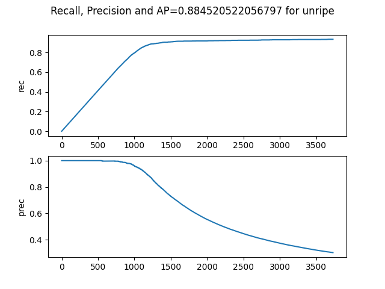

# Strawberry Detection and Classification - SSD
This is a project of using SSD object detection algorithm to detect strawberries and classify them according to ripeness.
## Get started
First, please install the required python package for this project.  
* PyTorch 1.7.1 (will be fast using CUDA GPU)
```angular2html
pip install torch==1.7.1+cu110 torchvision==0.8.2+cu110 torchaudio==0.7.2 -f https://download.pytorch.org/whl/torch_stable.html
```
* For other packages, please see the requirement.txt to install
```angular2html
pip install -r requirements.txt
```
## Data Preparation
For the dataset used for this project, please visit the following link to download.   
https://drive.google.com/file/d/1y8AenayMbzK-f3Cw4cg-0g93-FDtLlKI/view?usp=share_link  
And put the dataset under the **ssd512/SSD.Pytorch/Data/VOCdevkit** directory.  
The structure should be like this.  

## Train Model
Please follow the command to train the model, if you are in the root directory. And you may modify the parameters according to your needs and the configuration of your device.
```angular2html
cd ssd512
cd SSD.Pytorch
python train.py --input 512 --dataset_root ./data/VOCdevkit --num_class 4 --num_epoch 10 --batch_size 4
```
The trained model is defined as **VOC.pth** and stored in **./weights/**
## Evaluation and Test
Execute the following command to evaluate the model and test the test dataset.
```angular2html
python eval.py
python test.py
```
  
Here are the figures after running visualization.py, which shows the evaluation of the model.




## Demo
To perform an example of object detection using the trained model, execute the demo.py.
```angular2html
python demo.py
```
It will require you to enter the path to an image folder. The output will be an image with detected box and a YOLO format txt file.  
Here is an example.

## References
This project referred to the following two open source GitHub Project.  
https://github.com/midasklr/SSD.Pytorch  
https://github.com/amdegroot/ssd.pytorch  